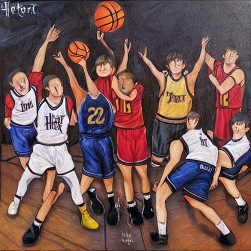

# Python backend for stable diffusion api

### - install dependencies for requirements.txt

### - create auth_token.py with api key from hugging face (to use pretrained models from hugging face)

### - api.py has been optimised for macs using mac silicon (device="mps" & enable_attention_slicing() for low ram devices)

### - run a uvicorn server in terminal [uvicorn api:app --reload]

### - check at http://127.0.0.1:8000/docs#/ to interact with the end points on swagger ui

    /generate: take in prompt as input to generate image

    /random: generate random prompt for use to generate image

### - each generate request takes about 45-50s to generate the image (depends on computing resources of the server)

### Sample Image: 

    Prompt Used: "monkey cyberpunk rockstar uhd"
